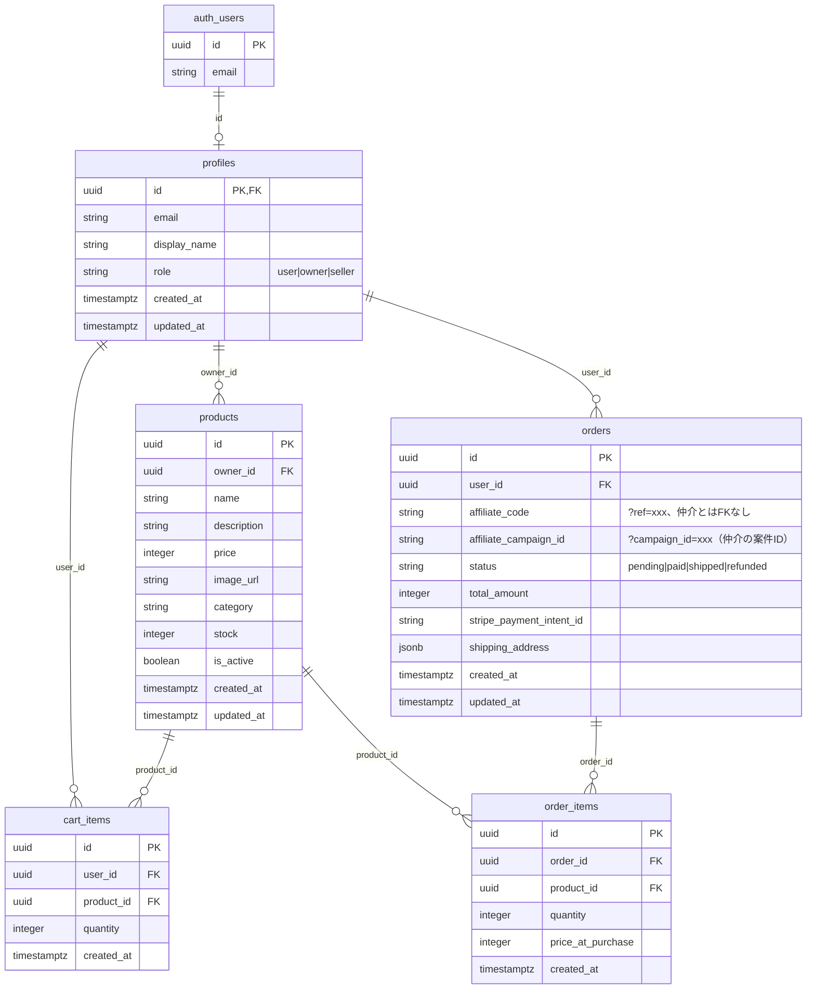
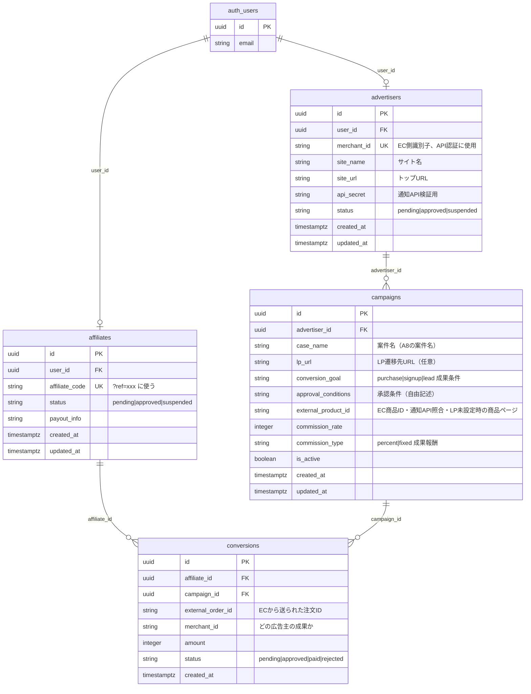

# Affina Shop アーキテクチャ（EC と仲介の分離）

## 設計方針

- **別ディレクトリ**: `intern/new_project`（EC）、`intern/intermediary`（仲介）で分離
- **別 DB**: 各々独立した Supabase プロジェクト
- **複数 EC 対応**: 仲介はプラットフォームとして、他 EC も同じ API 仕様で連携可能

```
┌─────────────────┐    通知API     ┌─────────────────┐
│ Affina Shop     │ ───────────────▶│ 仲介プラットフォーム │
│ (EC)            │   POST         │ (別 repo / 別 DB)  │
│ new_project     │                │ intermediary/     │
└─────────────────┘                │ 広告主・アフィリエイター│
                                   │ キャンペーン・成果    │
       ┌─────────────────┐         └─────────▲─────────┘
       │ 他社 EC サイト A  │ ── 同じAPI ──────┘
       └─────────────────┘

       ┌─────────────────┐
       │ 他社 EC サイト B  │ ── 同じAPI ──────┘
       └─────────────────┘
```

---

## 1. EC サイト側（Affina Shop / new_project）

**役割**: 自サイトの購入のみ。`?ref=xxx` を受け取り、購入時に仲介へ通知。



**EC 側の変更点**
- `orders.affiliate_code` (text, nullable) … `proxy` で `?ref=` を検知し httpOnly Cookie `affina_ref` に保存、チェックアウト時に注文へコピー
- `orders.affiliate_campaign_id` (text, nullable) … `?campaign_id=` を Cookie `affina_campaign` に保存し注文へコピー（仲介のアフィリンクが両方付与）
- 購入確定後、環境変数があれば `AFFINA_NOTIFICATION_URL` へ `Authorization: Bearer` で POST（`campaign_id` があれば body に含む。失敗しても注文は維持）

---

## 2. 仲介プラットフォーム側（別リポジトリ / 別 DB）

**役割**: 広告主・アフィリエイター登録、キャンペーン、成果管理。EC の内部構造に依存しない。



**仲介側のポイント**
- `advertisers.merchant_id` … 各 EC が仲介に登録時に発行。通知 API の認証に使用
- `campaigns` … A8 の「案件作成」に相当（案件名・LP URL・成果条件・承認条件・成果報酬）。`lp_url` が空なら `site_url/products/{external_product_id}` で広告リンクを生成
- `campaigns.external_product_id` … EC 側の商品 ID。通知 API の `items[].product_id` と照合
- `conversions.external_order_id` … EC から送られる注文 ID。重複チェックに使用
- EC のテーブルへの FK は一切なし

---

## 3. 通知 API の契約（EC → 仲介）

各 EC サイトが同一仕様で POST する。

```
POST {仲介のURL}/api/conversions
Headers:
  Authorization: Bearer {api_secret}   # または X-Merchant-Id + X-Api-Key
  Content-Type: application/json

Body:
{
  "merchant_id": "affina-shop-xxx",
  "order_id": "uuid-or-string",      # EC の orders.id
  "affiliate_code": "abc123",
  "campaign_id": "intermediary-campaign-uuid",  # 任意。?campaign_id= から
  "total_amount": 12800,
  "items": [
    { "product_id": "product-uuid-1", "quantity": 1, "price": 12800 }
  ]
}
```

仲介側の処理:
1. `merchant_id` + `api_secret` で広告主を認証
2. `affiliate_code` で affiliates を検索
3. `product_id` で campaigns を検索（該当なければスキップ or デフォルト報酬）
4. `conversions` に insert（`external_order_id` の重複チェック）

---

## 4. テーブル対応まとめ

| 所属 | テーブル | 役割 |
|------|----------|------|
| **EC** | profiles, products, cart_items, orders, order_items | 購入フロー、`affiliate_code` / `affiliate_campaign_id` で計測を保持 |
| **仲介** | auth.users, advertisers, affiliates, campaigns, conversions | 広告主・アフィリエイター、成果 |

**EC と仲介の結合**
- DB 上の結合はなし
- `affiliate_code`（文字列）と通知 API で連携

---

## 5. 図の確認方法

- [mermaid.live](https://mermaid.live) に各図のコードを貼り付けて表示
- GitHub / Notion / Cursor の Mermaid プレビュー
